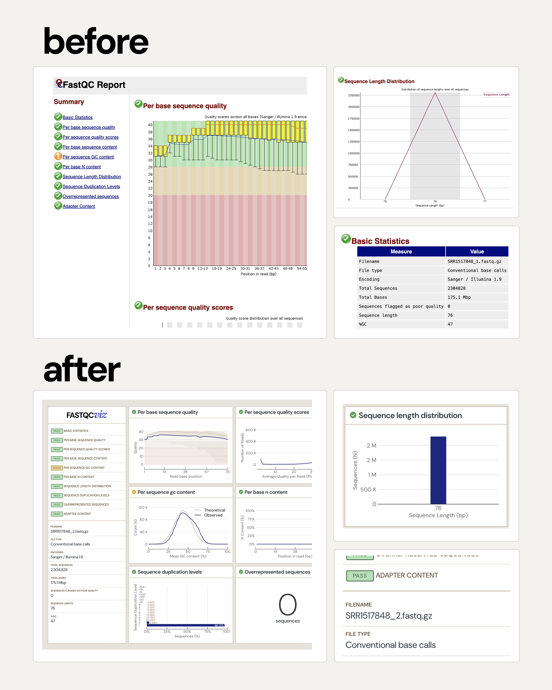

# fastqcviz

> [!NOTE]
> fastqcviz is currently in development.

Every bioinformatician knows the feeling of seeing that first [FastQC](https://github.com/s-andrews/FastQC) report. The iconic yellow boxplot, instantly recognizable, has become a symbol of quality control in genomics. 

While FastQC’s core utility remains unquestionable, its reporting interface, has somes _questionable_ design choices.

In **fastqcviz** I tried to give FastQC reports the aesthetic and functional love they deserve, transforming their insights into a more visually appealing experience without changing the core analysis.

**Classic report**: [FastQC](https://www.bioinformatics.babraham.ac.uk/projects/fastqc/good_sequence_short_fastqc.html)

**fasqcviz report** : [fastqcviz](https://html-preview.github.io/?url=https://github.com/barreiro-r/fastqc-viz/blob/example/example.html)

