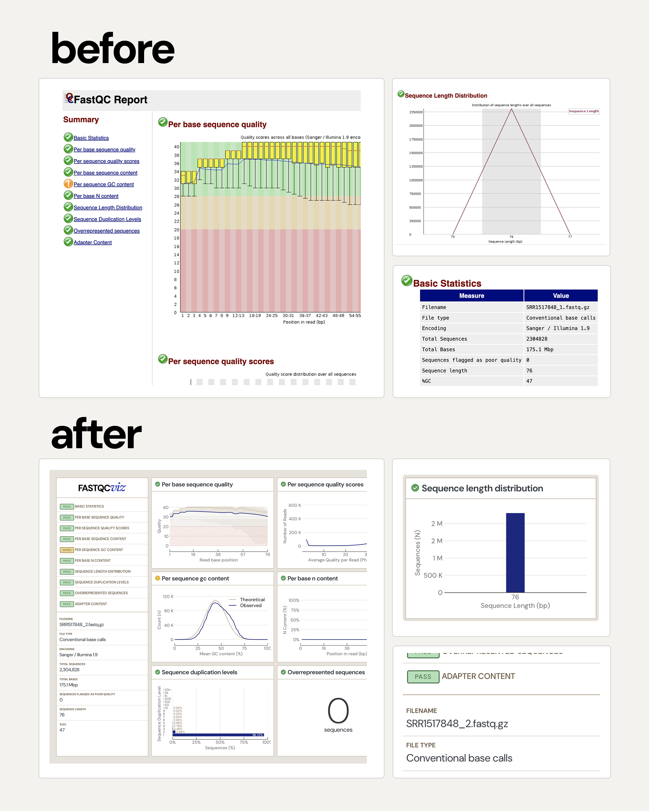

# fastqcviz

<!-- badges: start -->

<!-- badges: end -->

> \[!NOTE\] fastqcviz is currently in development.

Every bioinformatician knows the feeling of seeing that first
[FastQC](https://github.com/s-andrews/FastQC) report. The iconic yellow
boxplot, instantly recognizable, has become a symbol of quality control
in genomics.

While FastQC’s core utility remains unquestionable, its reporting
interface, has somes *questionable* design choices.

In **fastqcviz** I tried to give FastQC reports the aesthetic and
functional love they deserve, transforming their insights into a more
visually appealing experience without changing the core analysis.

**Classic report**:
[FastQC](https://www.bioinformatics.babraham.ac.uk/projects/fastqc/good_sequence_short_fastqc.html)

**fasqcviz report** :
[fastqcviz](https://html-preview.github.io/?url=https://github.com/barreiro-r/fastqc-viz/blob/example/example.html)

<figure>

<figcaption aria-hidden="true">img</figcaption>
</figure>

## Installation

You can install the development version of fastqcviz from
[GitHub](https://github.com/) with:

``` r
# install.packages("pak")
pak::pak("barreiro-r/fastqc-viz")
```

## Example

Using fastqcviz is as easy as:

``` r
library(fastqcviz)

create_fastqcviz_report("path/to/sample_fastqc/fastqc.txt", output_dir = "fastqcviz_report")
```
