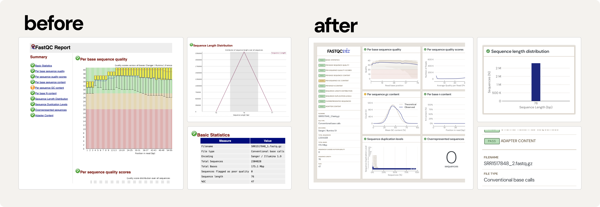

# fastqcviz <a href='https://github.com/barreiro-r/fastqc-viz/'></a>

<!-- badges: start -->

[](https://github.com/barreiro-r/fastqc-viz/actions/workflows/R-CMD-check.yaml)
[](https://app.codecov.io/gh/barreiro-r/fastqc-viz)
[](https://www.tidyverse.org/lifecycle/#experimental)
[](https://www.r-pkg.org/pkg/fastqcviz)
<!-- badges: end -->

The `fastqcviz` package was developed to give
[FastQC](https://github.com/s-andrews/FastQC) reports the aesthetic and
functional love it deserves, transforming its insights into a more
visually appealing experience without changing the core analysis. A
modest re-desing update for the classic FastQC report.

classic report:
[FastQC](https://www.bioinformatics.babraham.ac.uk/projects/fastqc/good_sequence_short_fastqc.html)
\| ✨ `fastqcviz` report :
[fastqcviz](https://html-preview.github.io/?url=https://github.com/barreiro-r/fastqc-viz/blob/main/man/figures/example.html)

<figure>

<figcaption aria-hidden="true">Screenshots of original FastQC and
fastqcviz reports.</figcaption>
</figure>

## Installation

You can install the development version of fastqcviz from
[GitHub](https://github.com/) with:

``` r
# install.packages("remotes")
remotes::install_github("barreiro-r/fastqc-viz")
```

## Example

Using fastqcviz is as easy as:

``` r
library(fastqcviz)

create_fastqcviz_report(
  fastqc_path = "path/to/sample_fastqc/fastqc_data.txt",
  output_dir = "fastqcviz_report",
  embed_resources = TRUE)
```
